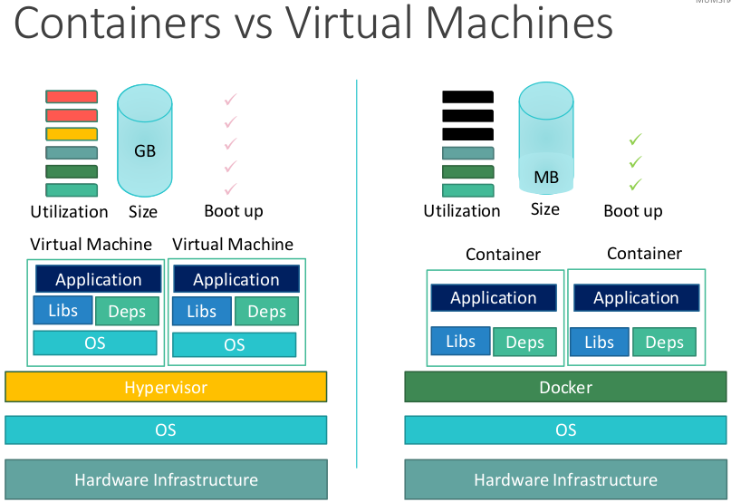

# Docker For Beginners

- [Docker For Beginners](#docker-for-beginners)
  - [1) Why Docker?](#1-why-docker)
    - [1.1) What Are Containers?](#11-what-are-containers)
    - [1.2) Docker Versions](#12-docker-versions)
  - [2) Docker Commands](#2-docker-commands)
    - [2.1) Basics](#21-basics)
      - [2.1.1) Containers](#211-containers)
      - [2.1.2) Images](#212-images)

## 1) Why Docker?

Mumshad's reasons for using Docker
* He was working on a project with a web server (NodeJS), database (MongoDB), messaging service (Redis), and an orchestrator (Ansible). It was a struggle to:
  * Get these services to work together on one O/S. As they all have different dependencies and supporting library requirements. Sometimes these are conflicting and cannot be resolved easily.
  * Get new developers to set up their own replica of this environment. A lot of time was wasted in trying to solve all the issues encountered above.

Docker solves this by
* Allowing each service to run in its own O/S inside its own container. This means that each service and its dependencies and required libraries were all separated from each other.
* Each developer could easily replicate the enivronment with some simple Docker commands.

### 1.1) What Are Containers?

* **Containers** are an isolated environment with its own resources (e.g. processes, network interfaces, storage etc) within an operating system but all containers within the same O/S share the same kernel.

* Containers are used to isolate applications from each other. Each container has its own O/S that supports the application and its dependencies.

* A container can only run on the same O/S kernel that it has. So if Docker is running on a Linux kernel, any Linux distribution can run on it. Running a Linux Docker container on Windows actually spins up a Linux VM.

* Containers are not new but Docker is a high level tool that has made them very popular.
* Docker uses LXC containers.
* Containers are more resource friendly than VMs. They are typically 100s of MB in size whereas VMs are typically GBs in size.  It is common to run containers within VMs.

* It is common to run containers inside of VMs. VMs are easy to provision in cloud environments and on premesis installations.

* A **Docker Image** is a template used to create a **Docker Container**. Thus like in OOP, the Docker Image is the blueprint and the Docker Container is the running instance.

* A **Dockerfile** is a file has the necessary steps to build a Docker Image and subsequent Containers.

* Traditionally a developer would hand over the operations team the compiled application and a list of instructions on how to deploy it. This would change with each environment and become complicated quickly. Now a developer just hads the operations team the Dockerfile and they are able to build the Docker Container the same way in each environment.

* Docker Images are publically available from Docker Hub. There are many images available for many types of O/S and applications.

* Docker contributes to DevOps by making it easier for operations teams to install applications that they received from development teams. The development team provies the Dockerfile and the operations team use this to deploy the application.

### 1.2) Docker Versions

* Docker has 2 versions:
1. **Community edition (CE)** is the set of free Docker products.
2. **Enterprise edition (EE)** comes with additional features that you need to pay for.

## 2) Docker Commands

### 2.1) Basics

**NOTE:** All Docker IDs only require enough characters in them to uniquely identify the object. You don't need to user the entire ID.

#### 2.1.1) Containers

* `docker run $IMAGE_NAME` will run the specified image on the current host as a container. If the current host doesn't have the image locally it will go to Docker Hub and download it. If the current host does have the image locally it will just use that image.
  * By default this will run in attached mode, i.e. your terminal will be attached to stdout of the container. Use `docker run -d $IMAGE_NAME` to run in detached mode.
  * `docker attach $CONTAINER_ID` and `docker attach $CONTAINER_NAME` can attach to a detached container.
* `docker ps` lists all the running containers and some basic information about them.
* `docker ps -a` lists all running containers and stopped containers and some basic information about them.
* **NOTE:** Each container automatically gets a random UID and name created for it.
* `docker stop $CONTAINER_ID` and `docker stop $CONTAINER_NAME` will stop a running container. These can still be viewed and take up space.
* `docker rm $CONTAINER_ID` and `docker rm $CONTAINER_NAME` will delete a stopped container.

#### 2.1.2) Images

* `docker images` lists all local images on the system.
* `docker rmi $IMAGE_NAME` and `docker rmi $IMAGE_ID` will delete all local images. All dependent containers must be stopped before deleting an image.
  * These are a shortcut for `docker iamge rm $IMAGE_NAME` and `docker image rm $IMAGE_ID`
* `docker pull $IMAGE` will download the specified image but not run it.
* **NOTE:** Container will only run while an application inside of them is running. This does not include shells like bash. So O/S images will exit immediately if they are only running a shell.
* `docker exec $IMAGE_NAME $CMD` and `docker exec $IMAGE_ID $CMD` executes a command on a running container.
  * Using `docker exec -it $IMAGE_NAME bash` and `docker exec -it $IMAGE_ID bash` will connect to the container in interactive mode (i.e. you can type) and load a shell.
* 