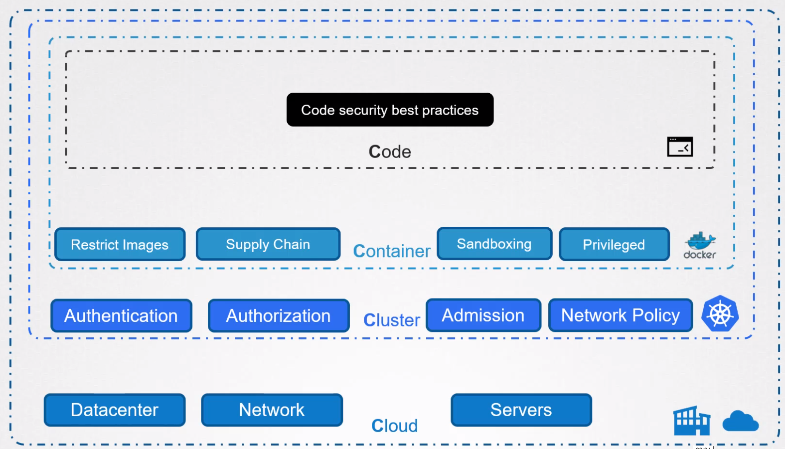
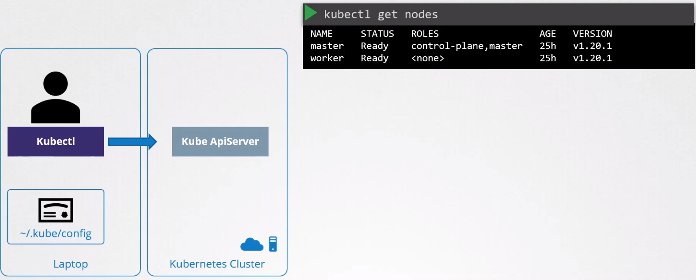
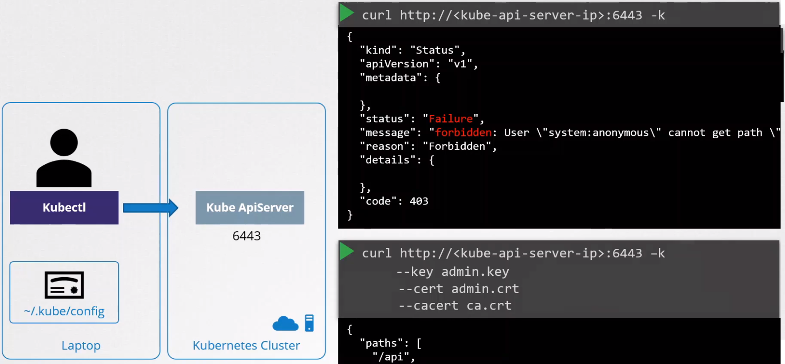
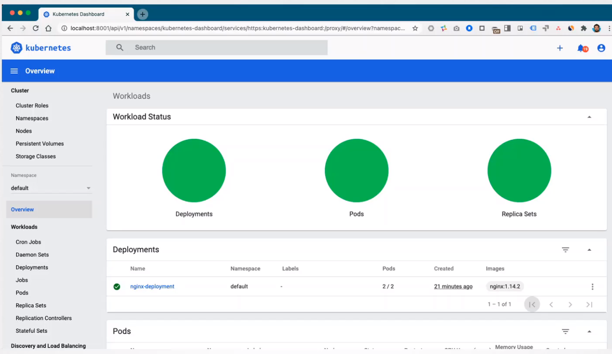
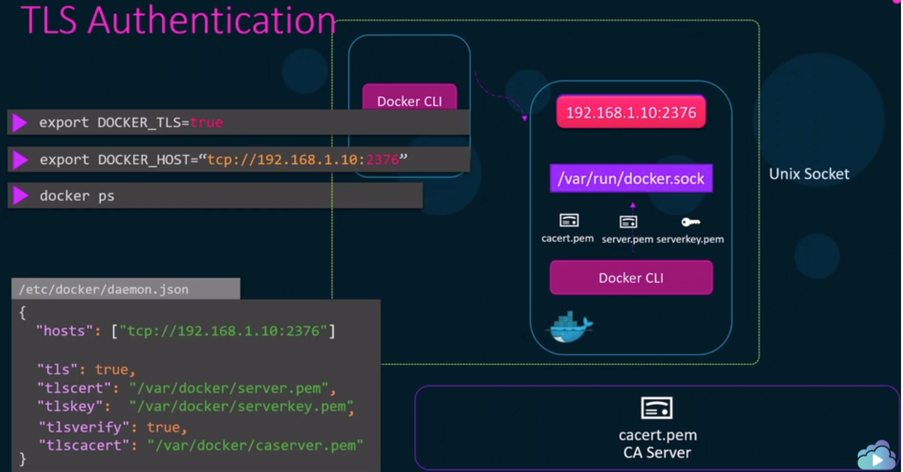
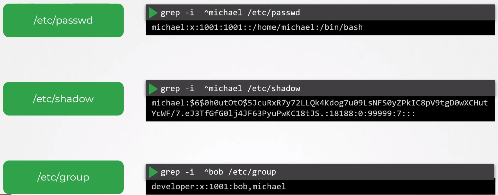

# k8s Security (CKS) Notes <!-- omit in toc -->

* Forth course in a series [[beginner](../02.applications-developer/README.md#1-core-concepts), [developer](../02.applications-developer/README.md#2-configuration), [administrator](../03.administrator/README.md#1-core-concepts), security]
* Can do the exam if you want, but you require CKA for this. There are plenty of mock exams for this.

- [1) Understanding The k8s Attack Surface](#1-understanding-the-k8s-attack-surface)
  - [The Attack Scenario](#the-attack-scenario)
  - [The 4 C's Of Cloud Native Security](#the-4-cs-of-cloud-native-security)
- [2) Cluster Setup & Hardening](#2-cluster-setup--hardening)
  - [CIS Benchmarks](#cis-benchmarks)
    - [CIS Benchmarks For k8s](#cis-benchmarks-for-k8s)
  - [kube-bench](#kube-bench)
  - [k8s Security Primitives](#k8s-security-primitives)
    - [Authentication](#authentication)
    - [TLS Encryption](#tls-encryption)
      - [TLS Basics](#tls-basics)
      - [TLS In k8s](#tls-in-k8s)
    - [Authorisation](#authorisation)
    - [Kubelet Security](#kubelet-security)
    - [kubectl Proxy & Port Forward](#kubectl-proxy--port-forward)
    - [k8s Dashboard](#k8s-dashboard)
      - [Securing k8s Dashboard](#securing-k8s-dashboard)
    - [k8s Software](#k8s-software)
      - [Versions](#versions)
      - [Verifying Application Binaries](#verifying-application-binaries)
      - [Cluster Upgrades](#cluster-upgrades)
    - [Network Policies](#network-policies)
    - [Ingress](#ingress)
    - [Docker](#docker)
      - [Securing The Docker Daemon](#securing-the-docker-daemon)
      - [System Service vs Daemon](#system-service-vs-daemon)
      - [Unix Socket vs TCP/IP Socket](#unix-socket-vs-tcpip-socket)
      - [TLS Encryption](#tls-encryption-1)
      - [Client Certificates](#client-certificates)
- [3) System Hardening](#3-system-hardening)
  - [Principle Of Least Privilege (PoLP)](#principle-of-least-privilege-polp)
  - [Minimising Host OS Footprint](#minimising-host-os-footprint)
  - [Limiting Node Access](#limiting-node-access)
  - [SSH Hardening](#ssh-hardening)
  - [Privilege Escalation In Linux](#privilege-escalation-in-linux)
  - [Removing Obsolete Packages & Services](#removing-obsolete-packages--services)
  - [Restricting Kernel Modules](#restricting-kernel-modules)
  - [Identifying & Disabling Open Ports](#identifying--disabling-open-ports)
  - [Minimising AWS IAM Roles](#minimising-aws-iam-roles)
  - [UFW Firewall Basics](#ufw-firewall-basics)
  - [Seccomp](#seccomp)
    - [Restricting Syscalls](#restricting-syscalls)
    - [k8s](#k8s)
  - [Kernel Hardening With AppArmor](#kernel-hardening-with-apparmor)
- [4) Minimising Microservices Vulnerabilities](#4-minimising-microservices-vulnerabilities)
- [5) Supply Chain Security](#5-supply-chain-security)
- [6) Monitoring, Logging, & Runtime Security](#6-monitoring-logging--runtime-security)

# 1) Understanding The k8s Attack Surface

## The Attack Scenario

There are 2 sites, 1 for voting and 1 for results. The attacker:

* Pings both websites using their domain names and finds they are on the same IP address. So they are on the same webserver.
* Does a port scan of the webserver IP address and finds the Docker service is open.
* Runs a Docker command against the server IP address and the default Docker behaviour is no authentication so the commands work. The running containers who k8s control plane components.


* Runs a privileged container on the webserver as root. Uses an exploit within the container to escape from the container and is now root on the webserver.


* From this position the attacker has full control of the webserver and can do anything.

## The 4 C's Of Cloud Native Security

https://kubernetes.io/docs/concepts/security/overview/

The 4 C's are:

1. **Cloud** or on-premesis, securing the entire platform infrastructure.
   1. Discussed in System Hardening and Monitoring, Logging, and Runtime Security
2. **Cluster**, securing the k8s cluster.
   1. Discussed in Cluster Setup & Hardening
3. **Container**, securing the container runtime engine.
   1. Discussed in Minimise Microservice Vulnerabilites and Supply Chain Security
4. **Code** for the application needs to be designed in a secure way.
   1. Kind of discussed in this course but mainly out of scope. e.g. the app should be built with TLS and not hard code secrets like database passwords.



# 2) Cluster Setup & Hardening

## CIS Benchmarks

https://www.cisecurity.org/cis-benchmarks/

A **security benchmarks** are configuration baselines and best practices for securely configuring a system. There are many tools that can provide this and a common one is CIS Benchmarks from the Center For Internet Security.


The CIS Benchmark suite covers cloud infrastructure, operating systems, networking, desktop and virtualisation applications, etcetera. To use it you download the CIS Benchmark for the area of concern and run it, the report will detail your current configuration against the best practice configuration and tell you what to do to secure your system.

CIS-CAT Lite can run the CIS Benchmarks and apply remediation processes automatically.

https://learn.cisecurity.org/cis-cat-lite

### CIS Benchmarks For k8s

https://www.cisecurity.org/cis-benchmarks/#kubernetes > Server Software > Virtualization > Kubernetes contains a configuration baseline for k8s. The CIS-CAT Pro is needed for k8s support. https://www.cisecurity.org/cybersecurity-tools/cis-cat-pro/cis-benchmarks-supported-by-cis-cat-pro/

## kube-bench

kube-bench can performan automated check on a k8s cluster to see if it is following security best practices from the k8s CIS Benchmark. It can install as a Docker container, as a Pod, or as a binary.

## k8s Security Primitives

See [CKA Security Primitives](../03.administrator/README.md#61-primitives)

### Authentication

For human accounts k8s doesn't manage user accounts natively, it relies on an external source (e.g. file, LDAP, etc) for that. Bots are covered by Service Accounts.

See [CKA Authentication](../03.administrator/README.md#61-authentication)

See [CKAD Service Accounts](../02.applications-developer/README.md#service-accounts)

The `default` Service Account that is automatically created in each namespace can be used to access the `kube-apiserver` but it is very heavily restricted in what it can do. Create your own Service Account for extra permissions.

### TLS Encryption

See [CKA TLS Encryption](../03.administrator/README.md#62-tls-encryption)

#### TLS Basics

See [CKA TLS Basics](../03.administrator/README.md#621--tls-basics)

#### TLS In k8s

See [CKA TLS In k8s](../03.administrator/README.md#622-tls-in-k8s)

See [CKA Creating Digital Certificates For k8s](../03.administrator/README.md#6221-creating-digital-certificates-for-k8s)

See [CKA Certificates API](../03.administrator/README.md#6222-certificates-api)

See [CKA Kube Config](../03.administrator/README.md#6223-kube-config)

### Authorisation

See [CKA API Groups](../03.administrator/README.md#63-api-groups)

See [CKA Authorisation](../03.administrator/README.md#64-authorisation)

### Kubelet Security

`kubeadm` doesn't automatically deploy `kubelet`, you need to do that manually. You should configure it securely before you manually deploy it. You can configure `kubelet` 2 ways:
1. Updating the flags in `kubelet` service file.
2. Updating the entries `kubelet` YAML config file. This is preferred and by default `kubeadm` installs this file at `/var/lib/kubelet/config.yaml` and this file uses camelCase.

**Note:** The flags in the service file take precedence over the entries in the YAML config file.

Use `ps aux | grep kubelet | grep config` to see where the `kubelet` YAML config file is, again by default `kubeadm` installs this file at `/var/lib/kubelet/config.yaml`.

The main things to secure within `kubelet` are:
* The 2 ports that `kubelet` serves on:
  * 10250 serves API with authenticated full access. The authentication depends on what mode is set. e.g. `curl -sk https://localhost:10250/pods/` will show you all Pods running in the cluster.
  * 10255 serves API with unauthenticated read only access. e.g. `curl -sk https://localhost:10255/metrics` will show you metrics for the cluster.
* By default the authentication mode is always allow.

You can secure `kubelet` via the service file or the YAML config file.
* The 2 ports that `kubelet` serves on can be secured by:
  * The API being served on port 10250 can be turned off by setting anonymous auth off. You can also change this API's authentication mode to use either x509 client certificates or API access tokens. Remember that the `kube-apiserver` is also a client so will require client access.
  * The API being served on port 10255 can be turned off by setting the port to 0.
* The default authorization can be updated to Webhook for example, which will delegate authorization to the `kube-apiserver`.


### kubectl Proxy & Port Forward

You can connect a variety of ways to the cluster.
* Using `kubectl` directly with the `$KUBECONFIG`.

* Using `curl` on port 6443, remember you need to specify client certificate and key.

* Using `kubectl proxy` with the `$KUBECONFIG` via localhost loopback address..
* Using `kubectl port-forward` with the `$KUBECONFIG`.


`kubectl proxy` opens proxy port to API server. It uses the `$KUBECONFIG` file to connection properties.

```bash
# Run the proxy
kubectl proxy
Starting to serve on 127.0.0.1:8001

# View all API end points
curl -k localhost:8001
```


`kubectl port-forward` opens a port to target deployment pods.

```bash
# Run the port forward
kubectl port-forward pod/$POD_NAME $LOCAL_PORT:$POD_PORT
kubectl port-forward svc/$SERVICE_NAME $LOCAL_PORT:$SERVICE_PORT

# View the forwarded app
curl -k localhost:$LOCAL_PORT
```

### k8s Dashboard

https://kubernetes.io/docs/tasks/access-application-cluster/web-ui-dashboard/

The k8s dashboard is a web based UI that can used to view and create cluster objects. It is a powerful tool that needs to be safeguarded. Tesla had their k8s cluster hijacked to mine cryptocurrency through this feature after they exposed it to the internet.




You can deploy the k8s dashboard through the YAML file at the k8s dashboard GitHub repository. The dashboard is now by default only accessible through a ClusterIP Service object making it available for local access only. You can get around this by using the Kube Proxy and accessing the ClusterIP service that way.


You could change the ClusterIP service to a NodePort service and gate access to that with some kind of IdAM solution.

#### Securing k8s Dashboard

When you access the k8s dashboard you get 2 authentication options:
* Token access from an existing Role or ClusterRole token that is stored in a Secret. The token within the secret must be base64 decoded first.
* KUBECONFIG access.


https://github.com/kubernetes/dashboard/blob/master/docs/user/access-control/creating-sample-user.md

You can combine existing ClusterRoles with Roles or ServiceAccounts to grant access within namespaces or the cluster itself.

### k8s Software

#### Versions

See [CKA Software Versions](../03.administrator/README.md#52-software-versions)

#### Verifying Application Binaries

The k8s binaries are available at the [k8s GitHub release page](https://github.com/kubernetes/kubernetes/releases). You must confirm all downloaded binary hashes against the hashes provided there.


```bash
# Method 1 - automatic check
# Create checksum file
cat > ${k8s_BINARY}.sha512
${k8s_BINARY} ${DOWNLOAD_PAGE_k8s_BINARY_SHA512_HASH}
^D

# Check the file against the checksum
sha512sum -c ${k8s_BINARY}.sha512

# Method 2 - manual check
sha512sum ${k8s_BINARY}

# Cross check hash against the hash on the page.
```

#### Cluster Upgrades

See [CKA Cluster Upgrades](../03.administrator/README.md#53-cluster-upgrades)

Use `kubeadm upgrade plan` to see what is the latest version you can upgrade to.

### Network Policies

See [CKA Network Policies](../03.administrator/README.md#65-network-policies)

### Ingress

See [CKA Ingress](../03.administrator/README.md#846-ingress)

In >= 1.20 you can create Ingress Resources via the command line.

```bash
# Format
kubectl create ing $NAME --rule="$DOMAIN_HOST/$URI_PATH=$SERVICE_NAME:$SERVICE_PORT"

# Example
kubectl create ing my-ingress --rule="wear.example.com/wear*=wear-service:8080"
```

### Docker

#### Securing The Docker Daemon

The Docker Daemon needs to be secured because anyone with access to it can:
* Delete any Docker object, e.g. containers or volumes.
* Create any Docker objects, e.g. container with a cryptominer.
* Run a privileged container and gain root access to the CRE host.

The host running the Docker Daemon needs securing as well. See (System Hardening)[#3-system-hardening]


#### System Service vs Daemon

The Docker daemon can be installed as a system service. You could also just run Docker daemon commands as well.

```bash
# Systemctl commands
systemctl start docker
systemctl status docker
systemctl restart docker
systemctl stop docker

# Docker Daemon commands
dockerd
dockerd --debug
```

#### Unix Socket vs TCP/IP Socket

The Docker Daemon listens on a Unix socket at `/var/run/docker.sock`. A [Unix socket](https://serverfault.com/a/124518) is an inter-process communication mechanism that allows bidirectional data exchange between processes running on the same machine. This means the Docker Daemon is only accessible on the same host.


[IP sockets](https://serverfault.com/a/124518), especially TCP/IP sockets, are a mechanism allowing communication between processes over the network. In some cases you can use TCP/IP sockets to talk with processes running on the same computer by using the loopback interface.

If you bound the Docker Daemon to an IP socket via the host's network interface it would be accessible on the network via anyone who can access that network interface. Do not do this over a public facing interface otherwise the public can access it.

```bash
# Start Docker Daemon listening on a TCP/IP socket
# 2375 is the standard Docker port using no encryption.
dockerd --host=tcp://$LOCAL_IP:2375
```

The other host needs to use `DOCKER_HOST=tcp://$LOCAL_IP:2375` so its docker commands are sent to the external Docker Daemon. Or use the equivalent `docker` command options.


Exposing the Docker Daemon on a TCP/IP socket is a security risk as by default Docker has no authentication mechanism and no encryption.

#### TLS Encryption

You can see up TLS with:

```bash
# 2376 is the standard Docker port using encryption.
dockerd --host=tcp://$LOCAL_IP:2376
# enable encryption
--tls=true \
--tlscert=/var/docker/server.crt \
--tlskey=/var/docker/server.key
```

The other host needs to use `DOCKER_HOST=tcp://$LOCAL_IP:2376` and `DOCKER_TLS=true` so its docker commands are sent to the external Docker Daemon using encryption. Or use the equivalent `docker` command options.


You can place Docker Daemon command line options into a JSON configuration file at `/etc/docker/daemon.json`. If you try to use the command line options and the config file at the same time there will be an error.


This configuration file is also read when you start the Docker Daemon as a system service.

#### Client Certificates

You can set up TLS client authentication with:

```bash
# 2376 is the standard Docker port using encryption.
dockerd --host=tcp://$LOCAL_IP:2376 \
# enable encryption
--tls=true \
--tlscert=/var/docker/server.crt \
--tlskey=/var/docker/server.key \
# enable client certificates
--tlsverify=true
--tlscacert=/var/docker/ca.cert
```



The client certificate can be supplied via the `docker` command option or placed into `~/.docker`. These client certificates must be signed by the Docker CA certificate.

# 3) System Hardening

## Principle Of Least Privilege (PoLP)

**Principle Of Least Privilege (PoLP)** addresses access control and states that an individual should have only the minimum access privileges necessary to perform a specific job or task and nothing more.

## Minimising Host OS Footprint

We can reduce the attack surface by having a strong security posture and implementing best practices for securing networks, hosts, applications, and user accounts.


## Limiting Node Access

The k8s Nodes should be deployed on a private network IP range and shouldn't be accessible from the internet directly, except via authorised channels like a VPN or from an allow listed CIDR range.


SSH access within the private network must be restricted as well. Only cluster administrators will require SSH access.

There are 4 types of Linux user accounts:
1. **User accounts**, these are for people who can log into the system and may or may not have administrator access.
2. **Superuser account**, the system account that can do anything on the system. Also known as root. User accounts can be granted access to this account.
3. **System accounts**, typically created during the O/S installation for software that will not run as the superuser.
4. Service accounts, are similar to the system accounts. They are created when when the service is installed and doesn't require to run as the superuser.


There are a variety of commands you can use to view information about Linux users.

```bash
# View information about the current user
id

# View the list of currently logged in users
who

# View the users who recently logged into the system
last
```


There are 3 popular files relating to Linux user accounts:

1. `/etc/passwd` contains information about the user, such as:
   1. Account name
   2. User ID (uid)
   3. Group name
   4. Group ID (gid)
   5. Login shell
   6. Home directory
2. `/etc/shadow` contains the hashed passwords of users.
3. `/etc/group` contains information about groups such as:
   1. Group name
   2. Group ID (gid)
   3. Group members (i.e. the users in that group.)



You can easily disable and delete users within Linux.
* Disable users by setting their shell to `/bin/nologin` inside of `/etc/passwd`.
* Delete users by using the `deluser $USERNAME` command.


You can easily remove users from groups that they shouldn't be in with the following commands:
* `gpasswd -d $USERNAME $GROUPNAME` works on Red Hat and Debian based systems.
* `deluser -d $USERNAME $GROUPNAME` works on Debian based systems.
* `usermod -g $GROUPS_TO_STAY_IN $USERNAME` works on Red Hat and Debian based systems. Remeber that you are omitting any groups you want to remove the user from.


## SSH Hardening

## Privilege Escalation In Linux

## Removing Obsolete Packages & Services

## Restricting Kernel Modules

## Identifying & Disabling Open Ports

## Minimising AWS IAM Roles

## UFW Firewall Basics

## Seccomp

### Restricting Syscalls

### k8s

## Kernel Hardening With AppArmor

# 4) Minimising Microservices Vulnerabilities

# 5) Supply Chain Security

# 6) Monitoring, Logging, & Runtime Security

