# k8s Security (CKS) Notes <!-- omit in toc -->

* Forth course in a series [[beginner](../02.applications-developer/README.md#1-core-concepts), [developer](../02.applications-developer/README.md#2-configuration), [administrator](../03.administrator/README.md#1-core-concepts), security]
* Can do the exam if you want, but you require CKA for this. There are plenty of mock exams for this.

- [1) Understanding The k8s Attack Surface](#1-understanding-the-k8s-attack-surface)
  - [The Attack Scenario](#the-attack-scenario)
  - [The 4 C's Of Cloud Native Security](#the-4-cs-of-cloud-native-security)
- [2) Cluster Setup & Hardening](#2-cluster-setup--hardening)
  - [CIS Benchmarks](#cis-benchmarks)
    - [CIS Benchmarks For k8s](#cis-benchmarks-for-k8s)
  - [kube-bench](#kube-bench)
  - [k8s Security Primitives](#k8s-security-primitives)
    - [Authentication](#authentication)
    - [TLS Encryption](#tls-encryption)
      - [TLS Basics](#tls-basics)
      - [TLS In k8s](#tls-in-k8s)
    - [Authorisation](#authorisation)
    - [Kubelet Security](#kubelet-security)
    - [kubectl Proxy & Port Forward](#kubectl-proxy--port-forward)
    - [k8s Dashboard](#k8s-dashboard)
      - [Securing k8s Dashboard](#securing-k8s-dashboard)
    - [k8s Software](#k8s-software)
      - [Versions](#versions)
      - [Verifying Application Binaries](#verifying-application-binaries)
      - [Cluster Upgrades](#cluster-upgrades)
    - [Network Policies](#network-policies)
    - [Ingress](#ingress)
    - [Docker](#docker)
      - [Securing The Docker Daemon](#securing-the-docker-daemon)
      - [System Service vs Daemon](#system-service-vs-daemon)
      - [Unix Socket vs TCP/IP Socket](#unix-socket-vs-tcpip-socket)
      - [TLS Encryption](#tls-encryption-1)
      - [Client Certificates](#client-certificates)
- [3) System Hardening](#3-system-hardening)
  - [Principle Of Least Privilege (PoLP)](#principle-of-least-privilege-polp)
  - [Minimising Host OS Footprint](#minimising-host-os-footprint)
  - [Limiting Node Access](#limiting-node-access)
  - [SSH](#ssh)
    - [Hardening](#hardening)
  - [Privilege Escalation In Linux](#privilege-escalation-in-linux)
  - [Removing Obsolete Packages & Services](#removing-obsolete-packages--services)
    - [Software](#software)
    - [Services](#services)
  - [Restricting Kernel Modules](#restricting-kernel-modules)
  - [Identifying & Disabling Open Ports](#identifying--disabling-open-ports)
  - [Cloud IdAM](#cloud-idam)
  - [Restricting Network Access](#restricting-network-access)
    - [UFW Firewall Basics](#ufw-firewall-basics)
  - [Linux Syscalls](#linux-syscalls)
    - [AquaSec Tracee](#aquasec-tracee)
    - [Restricting Syscalls With Seccomp](#restricting-syscalls-with-seccomp)
    - [Seccomp Within k8s](#seccomp-within-k8s)
  - [Kernel Hardening With AppArmor](#kernel-hardening-with-apparmor)
- [4) Minimising Microservices Vulnerabilities](#4-minimising-microservices-vulnerabilities)
- [5) Supply Chain Security](#5-supply-chain-security)
- [6) Monitoring, Logging, & Runtime Security](#6-monitoring-logging--runtime-security)

# 1) Understanding The k8s Attack Surface

## The Attack Scenario

There are 2 sites, 1 for voting and 1 for results. The attacker:

* Pings both websites using their domain names and finds they are on the same IP address. So they are on the same webserver.
* Does a port scan of the webserver IP address and finds the Docker service is open.
* Runs a Docker command against the server IP address and the default Docker behaviour is no authentication so the commands work. The running containers who k8s control plane components.


* Runs a privileged container on the webserver as root. Uses an exploit within the container to escape from the container and is now root on the webserver.


* From this position the attacker has full control of the webserver and can do anything.

## The 4 C's Of Cloud Native Security

https://kubernetes.io/docs/concepts/security/overview/

The 4 C's are:

1. **Cloud** or on-premesis, securing the entire platform infrastructure.
   1. Discussed in System Hardening and Monitoring, Logging, and Runtime Security
2. **Cluster**, securing the k8s cluster.
   1. Discussed in Cluster Setup & Hardening
3. **Container**, securing the container runtime engine.
   1. Discussed in Minimise Microservice Vulnerabilites and Supply Chain Security
4. **Code** for the application needs to be designed in a secure way.
   1. Kind of discussed in this course but mainly out of scope. e.g. the app should be built with TLS and not hard code secrets like database passwords.


# 2) Cluster Setup & Hardening

## CIS Benchmarks

https://www.cisecurity.org/cis-benchmarks/

A **security benchmarks** are configuration baselines and best practices for securely configuring a system. There are many tools that can provide this and a common one is CIS Benchmarks from the Center For Internet Security.


The CIS Benchmark suite covers cloud infrastructure, operating systems, networking, desktop and virtualisation applications, etcetera. To use it you download the CIS Benchmark for the area of concern and run it, the report will detail your current configuration against the best practice configuration and tell you what to do to secure your system.

CIS-CAT Lite can run the CIS Benchmarks and apply remediation processes automatically.

https://learn.cisecurity.org/cis-cat-lite

Go to https://www.cisecurity.org/benchmark/distribution_independent_linux for Linux distribution independent advice.

### CIS Benchmarks For k8s

https://www.cisecurity.org/cis-benchmarks/#kubernetes > Server Software > Virtualization > Kubernetes contains a configuration baseline for k8s. The CIS-CAT Pro is needed for k8s support. https://www.cisecurity.org/cybersecurity-tools/cis-cat-pro/cis-benchmarks-supported-by-cis-cat-pro/

## kube-bench

kube-bench can performan automated check on a k8s cluster to see if it is following security best practices from the k8s CIS Benchmark. It can install as a Docker container, as a Pod, or as a binary.

## k8s Security Primitives

See [CKA Security Primitives](../03.administrator/README.md#61-primitives)

### Authentication

For human accounts k8s doesn't manage user accounts natively, it relies on an external source (e.g. file, LDAP, etc) for that. Bots are covered by Service Accounts.

See [CKA Authentication](../03.administrator/README.md#61-authentication)

See [CKAD Service Accounts](../02.applications-developer/README.md#service-accounts)

The `default` Service Account that is automatically created in each namespace can be used to access the `kube-apiserver` but it is very heavily restricted in what it can do. Create your own Service Account for extra permissions.

### TLS Encryption

See [CKA TLS Encryption](../03.administrator/README.md#62-tls-encryption)

#### TLS Basics

See [CKA TLS Basics](../03.administrator/README.md#621--tls-basics)

#### TLS In k8s

See [CKA TLS In k8s](../03.administrator/README.md#622-tls-in-k8s)

See [CKA Creating Digital Certificates For k8s](../03.administrator/README.md#6221-creating-digital-certificates-for-k8s)

See [CKA Certificates API](../03.administrator/README.md#6222-certificates-api)

See [CKA Kube Config](../03.administrator/README.md#6223-kube-config)

### Authorisation

See [CKA API Groups](../03.administrator/README.md#63-api-groups)

See [CKA Authorisation](../03.administrator/README.md#64-authorisation)

### Kubelet Security

`kubeadm` doesn't automatically deploy `kubelet`, you need to do that manually. You should configure it securely before you manually deploy it. You can configure `kubelet` 2 ways:
1. Updating the flags in `kubelet` service file.
2. Updating the entries `kubelet` YAML config file. This is preferred and by default `kubeadm` installs this file at `/var/lib/kubelet/config.yaml` and this file uses camelCase.

**Note:** The flags in the service file take precedence over the entries in the YAML config file.

Use `ps aux | grep kubelet | grep config` to see where the `kubelet` YAML config file is, again by default `kubeadm` installs this file at `/var/lib/kubelet/config.yaml`.

The main things to secure within `kubelet` are:
* The 2 ports that `kubelet` serves on:
  * 10250 serves API with authenticated full access. The authentication depends on what mode is set. e.g. `curl -sk https://localhost:10250/pods/` will show you all Pods running in the cluster.
  * 10255 serves API with unauthenticated read only access. e.g. `curl -sk https://localhost:10255/metrics` will show you metrics for the cluster.
* By default the authentication mode is always allow.

You can secure `kubelet` via the service file or the YAML config file.
* The 2 ports that `kubelet` serves on can be secured by:
  * The API being served on port 10250 can be turned off by setting anonymous auth off. You can also change this API's authentication mode to use either x509 client certificates or API access tokens. Remember that the `kube-apiserver` is also a client so will require client access.
  * The API being served on port 10255 can be turned off by setting the port to 0.
* The default authorization can be updated to Webhook for example, which will delegate authorization to the `kube-apiserver`.


### kubectl Proxy & Port Forward

You can connect a variety of ways to the cluster.
* Using `kubectl` directly with the `$KUBECONFIG`.

* Using `curl` on port 6443, remember you need to specify client certificate and key.

* Using `kubectl proxy` with the `$KUBECONFIG` via localhost loopback address..
* Using `kubectl port-forward` with the `$KUBECONFIG`.


`kubectl proxy` opens proxy port to API server. It uses the `$KUBECONFIG` file to connection properties.

```bash
# Run the proxy
kubectl proxy
Starting to serve on 127.0.0.1:8001

# View all API end points
curl -k localhost:8001
```

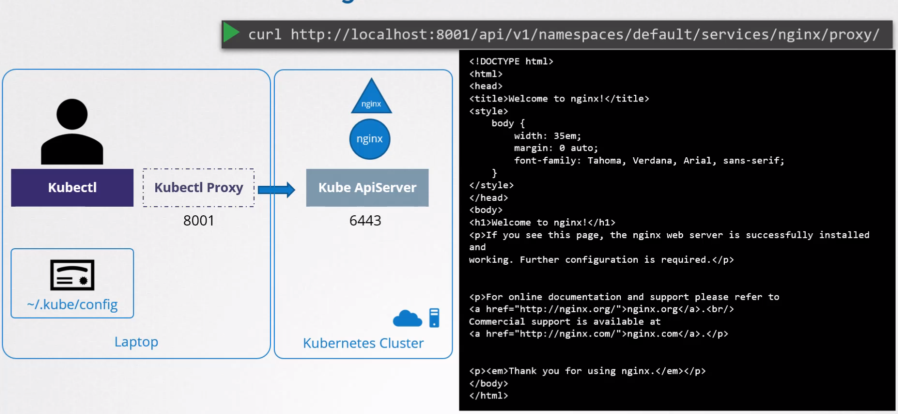


`kubectl port-forward` opens a port to target deployment pods.

```bash
# Run the port forward
kubectl port-forward pod/$POD_NAME $LOCAL_PORT:$POD_PORT
kubectl port-forward svc/$SERVICE_NAME $LOCAL_PORT:$SERVICE_PORT

# View the forwarded app
curl -k localhost:$LOCAL_PORT
```

### k8s Dashboard

https://kubernetes.io/docs/tasks/access-application-cluster/web-ui-dashboard/

The k8s dashboard is a web based UI that can used to view and create cluster objects. It is a powerful tool that needs to be safeguarded. Tesla had their k8s cluster hijacked to mine cryptocurrency through this feature after they exposed it to the internet.


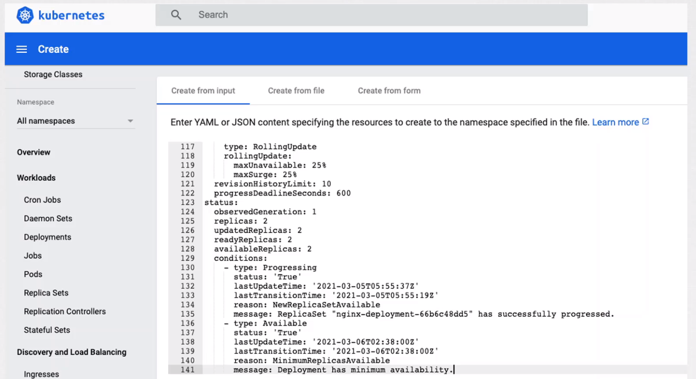

You can deploy the k8s dashboard through the YAML file at the k8s dashboard GitHub repository. The dashboard is now by default only accessible through a ClusterIP Service object making it available for local access only. You can get around this by using the Kube Proxy and accessing the ClusterIP service that way.


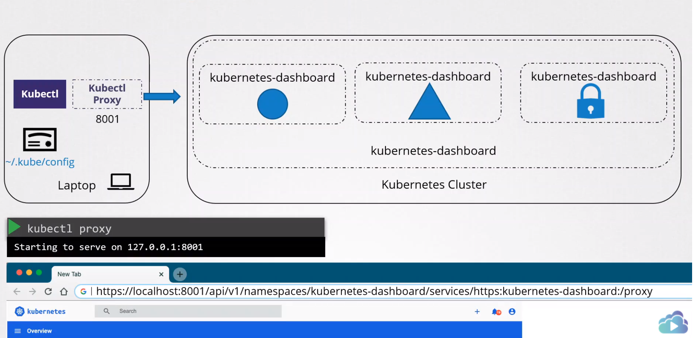

You could change the ClusterIP service to a NodePort service and gate access to that with some kind of IdAM solution.

#### Securing k8s Dashboard

When you access the k8s dashboard you get 2 authentication options:
* Token access from an existing Role or ClusterRole token that is stored in a Secret. The token within the secret must be base64 decoded first.
* KUBECONFIG access.


https://github.com/kubernetes/dashboard/blob/master/docs/user/access-control/creating-sample-user.md

You can combine existing ClusterRoles with Roles or ServiceAccounts to grant access within namespaces or the cluster itself.

### k8s Software

#### Versions

See [CKA Software Versions](../03.administrator/README.md#52-software-versions)

#### Verifying Application Binaries

The k8s binaries are available at the [k8s GitHub release page](https://github.com/kubernetes/kubernetes/releases). You must confirm all downloaded binary hashes against the hashes provided there.


```bash
# Method 1 - automatic check
# Create checksum file
cat > ${k8s_BINARY}.sha512
${k8s_BINARY} ${DOWNLOAD_PAGE_k8s_BINARY_SHA512_HASH}
^D

# Check the file against the checksum
sha512sum -c ${k8s_BINARY}.sha512

# Method 2 - manual check
sha512sum ${k8s_BINARY}

# Cross check hash against the hash on the page.
```

#### Cluster Upgrades

See [CKA Cluster Upgrades](../03.administrator/README.md#53-cluster-upgrades)

Use `kubeadm upgrade plan` to see what is the latest version you can upgrade to.

### Network Policies

See [CKA Network Policies](../03.administrator/README.md#65-network-policies)

### Ingress

See [CKA Ingress](../03.administrator/README.md#846-ingress)

In >= 1.20 you can create Ingress Resources via the command line.

```bash
# Format
kubectl create ing $NAME --rule="$DOMAIN_HOST/$URI_PATH=$SERVICE_NAME:$SERVICE_PORT"

# Example
kubectl create ing my-ingress --rule="wear.example.com/wear*=wear-service:8080"
```

### Docker

#### Securing The Docker Daemon

The Docker Daemon needs to be secured because anyone with access to it can:
* Delete any Docker object, e.g. containers or volumes.
* Create any Docker objects, e.g. container with a cryptominer.
* Run a privileged container and gain root access to the CRE host.

The host running the Docker Daemon needs securing as well. See (System Hardening)[#3-system-hardening]


#### System Service vs Daemon

The Docker daemon can be installed as a system service. You could also just run Docker daemon commands as well.

```bash
# Systemctl commands
systemctl start docker
systemctl status docker
systemctl restart docker
systemctl stop docker

# Docker Daemon commands
dockerd
dockerd --debug
```

#### Unix Socket vs TCP/IP Socket

The Docker Daemon listens on a Unix socket at `/var/run/docker.sock`. A [Unix socket](https://serverfault.com/a/124518) is an inter-process communication mechanism that allows bidirectional data exchange between processes running on the same machine. This means the Docker Daemon is only accessible on the same host.

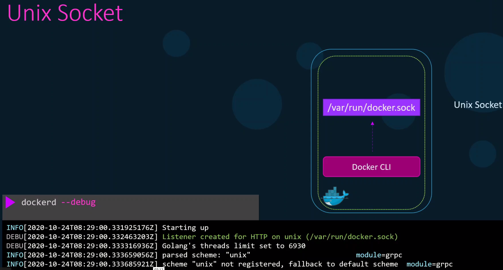

[IP sockets](https://serverfault.com/a/124518), especially TCP/IP sockets, are a mechanism allowing communication between processes over the network. In some cases you can use TCP/IP sockets to talk with processes running on the same computer by using the loopback interface.

If you bound the Docker Daemon to an IP socket via the host's network interface it would be accessible on the network via anyone who can access that network interface. Do not do this over a public facing interface otherwise the public can access it.

```bash
# Start Docker Daemon listening on a TCP/IP socket
# 2375 is the standard Docker port using no encryption.
dockerd --host=tcp://$LOCAL_IP:2375
```

The other host needs to use `DOCKER_HOST=tcp://$LOCAL_IP:2375` so its docker commands are sent to the external Docker Daemon. Or use the equivalent `docker` command options.


Exposing the Docker Daemon on a TCP/IP socket is a security risk as by default Docker has no authentication mechanism and no encryption.

#### TLS Encryption

You can see up TLS with:

```bash
# 2376 is the standard Docker port using encryption.
dockerd --host=tcp://$LOCAL_IP:2376
# enable encryption
--tls=true \
--tlscert=/var/docker/server.crt \
--tlskey=/var/docker/server.key
```

The other host needs to use `DOCKER_HOST=tcp://$LOCAL_IP:2376` and `DOCKER_TLS=true` so its docker commands are sent to the external Docker Daemon using encryption. Or use the equivalent `docker` command options.


You can place Docker Daemon command line options into a JSON configuration file at `/etc/docker/daemon.json`. If you try to use the command line options and the config file at the same time there will be an error.


This configuration file is also read when you start the Docker Daemon as a system service.

#### Client Certificates

You can set up TLS client authentication with:

```bash
# 2376 is the standard Docker port using encryption.
dockerd --host=tcp://$LOCAL_IP:2376 \
# enable encryption
--tls=true \
--tlscert=/var/docker/server.crt \
--tlskey=/var/docker/server.key \
# enable client certificates
--tlsverify=true
--tlscacert=/var/docker/ca.cert
```


The client certificate can be supplied via the `docker` command option or placed into `~/.docker`. These client certificates must be signed by the Docker CA certificate.

# 3) System Hardening

Go to https://www.cisecurity.org/benchmark/distribution_independent_linux for Linux distribution independent advice.

## Principle Of Least Privilege (PoLP)

**Principle Of Least Privilege (PoLP)** addresses access control and states that an individual should have only the minimum access privileges necessary to perform a specific job or task and nothing more.

## Minimising Host OS Footprint

We can reduce the attack surface by having a strong security posture and implementing best practices for securing networks, hosts, applications, and user accounts.


## Limiting Node Access

The k8s Nodes should be deployed on a private network IP range and shouldn't be accessible from the internet directly, except via authorised channels like a VPN or from an allow listed CIDR range.


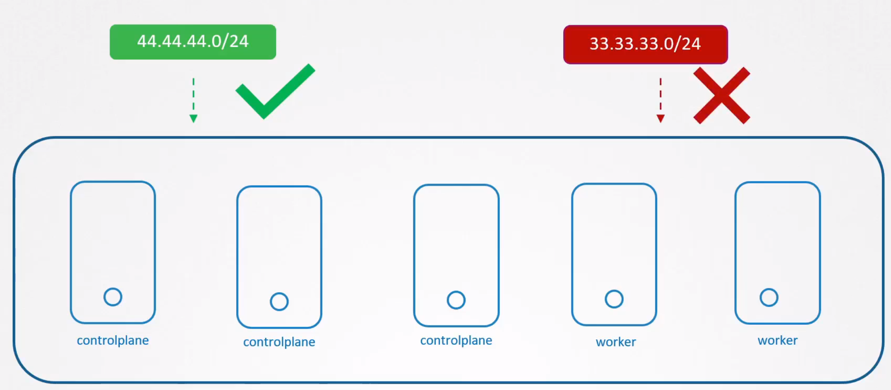

SSH access within the private network must be restricted as well. Only cluster administrators will require SSH access.

There are 4 types of Linux user accounts:
1. **User accounts**, these are for people who can log into the system and may or may not have administrator access.
2. **Superuser account**, the system account that can do anything on the system. Also known as root. User accounts can be granted access to this account.
3. **System accounts**, typically created during the O/S installation for software that will not run as the superuser.
4. Service accounts, are similar to the system accounts. They are created when when the service is installed and doesn't require to run as the superuser.

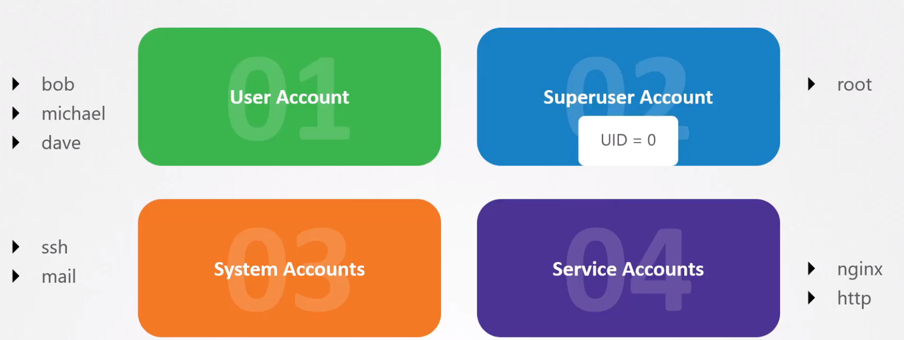

There are a variety of commands you can use to view information about Linux users.

```bash
# View information about the current user
id

# View the list of currently logged in users
who

# View the users who recently logged into the system
last
```

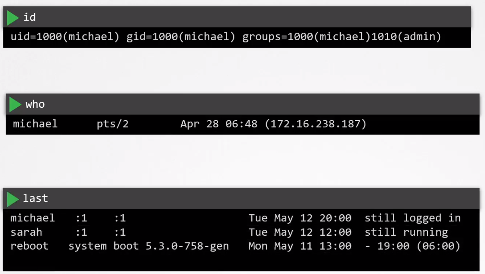

There are 3 popular files relating to Linux user accounts:

1. `/etc/passwd` contains information about the user, such as:
   1. Account name
   2. User ID (uid)
   3. Group name
   4. Group ID (gid)
   5. Login shell
   6. Home directory
2. `/etc/shadow` contains the hashed passwords of users.
3. `/etc/group` contains information about groups such as:
   1. Group name
   2. Group ID (gid)
   3. Group members (i.e. the users in that group.)


You can easily disable and delete users within Linux.
* Disable users by setting their shell to `/bin/nologin` inside of `/etc/passwd`.
* Delete users by using the `deluser $USERNAME` command.


You can easily remove users from groups that they shouldn't be in with the following commands:
* `gpasswd -d $USERNAME $GROUPNAME` works on Red Hat and Debian based systems.
* `deluser -d $USERNAME $GROUPNAME` works on Debian based systems.
* `usermod -g $GROUPS_TO_STAY_IN $USERNAME` works on Red Hat and Debian based systems. Remeber that you are omitting any groups you want to remove the user from.


## SSH

SSH is used to securely connect to an external server with a username and password or via ssh key pairs. Here are some important things to remember about ssh:

* The default connection strategy is username and password.
* The default port for ssh 22.
* The default directory for ssh files is `~/.ssh` for the client and server.
* On the client:
  * ssh keys are stored in `~/.ssh/id_$ALGORITHM`
  * The global ssh configuration is stored in `/etc/ssh/ssh_config` which can be overriden with `~/.ssh/config`
  * Metadata about ssh servers that have been connected to from this client is stored in `~/.ssh/known_hosts`
* On the server:
  * ssh keys copied from previously connected clients are are stored in `~/.ssh/authorized_keys`.
  * The global ssh daemon configuration is stored in `/etc/ssh/sshd_config`

```bash
# Connect as the current user
ssh $HOSTNAME
ssh $IP_ADDRESS

# Connect as a different user
ssh $USERNAME@$HOSTNAME
ssh $USERNAME@$IP_ADDRESS
```


It is not considered best practice to use username and passwords for ssh connections, you should use ssh keys instead. Remember that you need to use username and password to supply the key to the remote host.

```bash
# Create an ssh key, the default path is ~/.ssh/
ssh-keygen
ssh-keygen -t $ALGORITHM
ssh-keygen -t $ALGORITHM -i $KEY_PATH
```


```bash
# Copy ssh key to a server
ssh-copy-id -i $KEY_PATH $USERNAME@$HOSTNAME
ssh-copy-id -i $KEY_PATH $USERNAME@$IP_ADDRESS
```

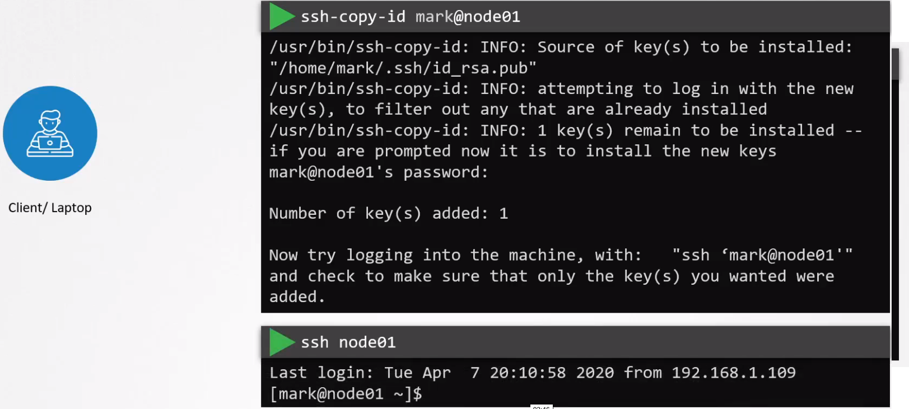

### Hardening

CIS section 5.2 has elaborate steps to harden the ssh service. But the following basic steps should be used to harden ssh via the `/etc/ssh/sshd_config` file:
* Disable root logins over ssh.
* Disable password logins over ssh.


**Note:** Remember to restart the sshd service after making changes to the configuration.

## Privilege Escalation In Linux

Using root as the daily driver account is a bad idea. But you will need to use the root user to perform some tasks within the system. The best way to do this is via `su` or `sudo`.
* The `su` command will ask for the root account password before switching to the root user.
* The `sudo` command will ask for the current user's account password before switching to the root user. That user must be granted `sudo` access within `/etc/sudoers` file or `/etc/sudoers.d/` included files.

**Note:** You should update `/etc/sudoers` with `visudo` as this command will validate the file and make sure you don't make any breaking changes which may lock you out of the root account.


Once you have granted `sudo` access you could then disable the root user account by updating the root account shell to `/usr/sbin/nologin` inside of `/etc/passwd`.

[The syntax](https://askubuntu.com/a/118227) for `/etc/sudoers` is:
* Comments are lines that start with a `#`
* The first field is the user or group that privileges are being granted to. Groups must begin with a percent sign, e.g. `%sudo`
* The second field is which host the user can use `sudo` on. By default this is ALL and on a typical setup this just means localhost. If you were sharing this file across mutiple hosts you can supply hostnames here.
* The third field enclosed in brackets is the users `-u` and which groups `-g` can be used to run commands. By default this is ALL which means any user or group.
* The forth field is the command(s) that can be run. By default this is ALL which means any command.


You can make `sudo` switching passwordless with `$USER ALL=(ALL:ALL) NOPASSWD:ALL` inside of `/etc/sudoers`

## Removing Obsolete Packages & Services

### Software

Best practice dictates to ensure only the required software is installed on the system and to ensure that software is kept up to date.

```bash
# Ubuntu - install a package
apt install $PACKAGE_NAME

# Ubuntu - remove a package
apt remove $PACKAGE_NAME

# Ubuntu - refresh package cache data
apt update

# Ubuntu -- upgrade all packages
apt upgrade

# Ubuntu - refresh package cache data and upgrade all packages
apt update -y && apt upgrade
```


```bash
# Red Hat - install a package
dnf install $PACKAGE_NAME

# Red Hat - remove a package
dnf remove $PACKAGE_NAME

# Red Hat - refresh package cache data and upgrade all packages
dnf upgrade --refresh
```

### Services

You should also only enable O/S services that are needed. Remember that service files are installed when the package is installed, these may or may not be automatically enabled and started.

O/S service files are located in `/lib/systemd/system/$SERVICE_NAME`

```bash
# View all active services on the system
systemctl list-units --type service

# Check the service's status
systemctl status $SERVICE_NAME

# Start a service
systemctl start $SERVICE_NAME
systemctl restart $SERVICE_NAME

# Automatically start a service at boot time
systemctl enable  $SERVICE_NAME

# Stop a service
systemctl stop $SERVICE_NAME

# Disable a service from automatically starting at boot time
systemctl disable $SERVICE_NAME
```


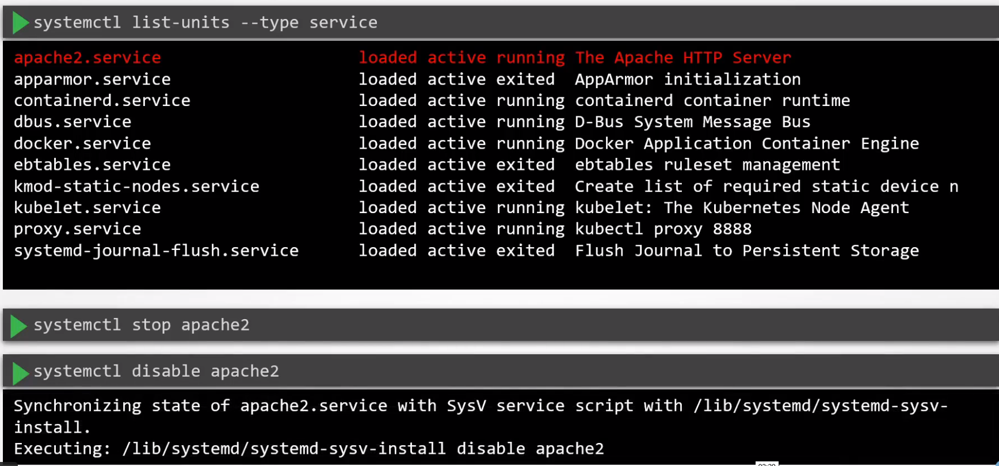

CIS section 2 has elaborate steps to harden the O/S services.

## Restricting Kernel Modules

**Kernel modules** are pieces of code that can be loaded and unloaded into the kernel upon demand. They extend the functionality of the kernel without needing to reboot the system. A common example of this is a GPU hardware device driver being loaded as a kernel module after a GPU has been installed.


You can manually load a kernel module into the kernel using `modprobe $MODULE_NAME`. You can list all running kernel modules using `lsmod`.

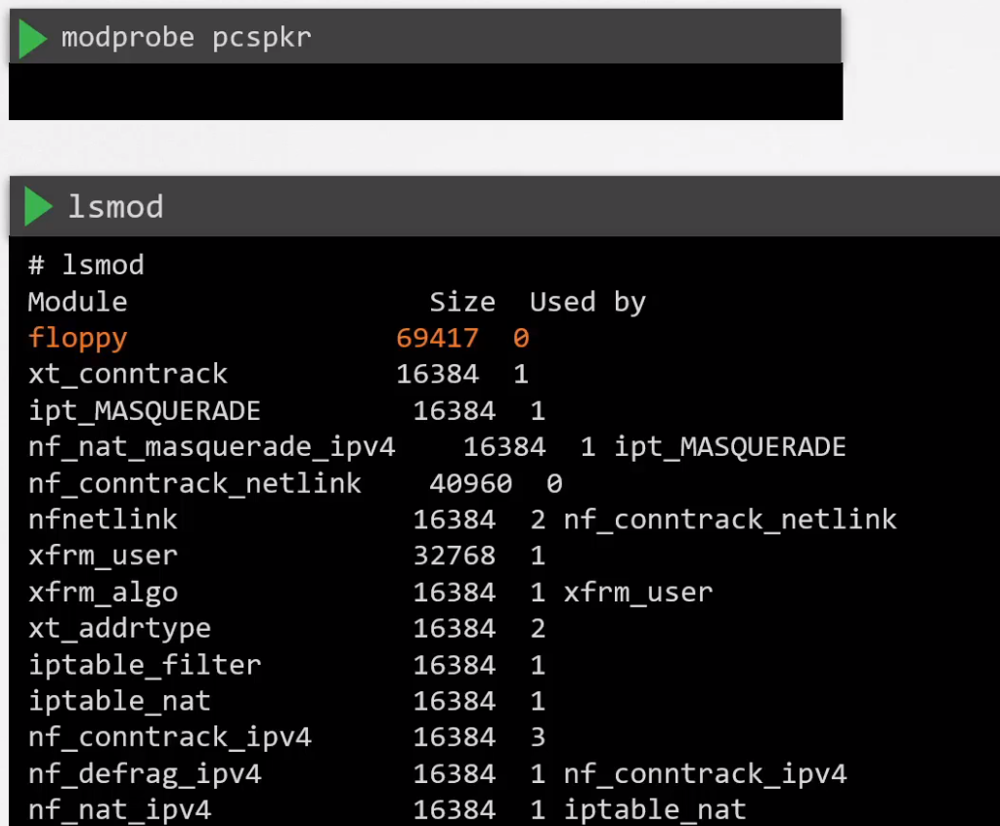

It is security best practise to disable and disallow unnecessary kernel modules. You can disallow kernel modules by adding them to a deny list which is typically stored at `/etc/modprobe.d/blacklist.conf`. This file can be called anything but must have the `.conf` extension. A reboot is required to add a kernel module to the deny list.


In k8s to common kernel modules to disable are sctp and dccp. CIS section 3.4 has elaborate steps to harden kernel modules.

## Identifying & Disabling Open Ports

When applications and services they can bind to a port on the host's network interface. Once bound, the host's IP address and this port can allow traffic into the host.

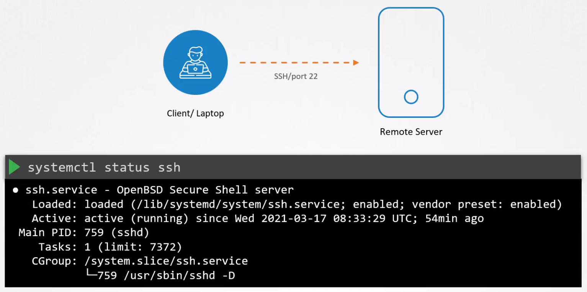

You can view all the ports currently be used by the system in a variety of ways, 2 common approaches are `netstat` and `ss`.

```bash
# View all TCP and UPD ports on the system, regardless of their state
ss -antup
netstat -antup

# View listening TCP only
ss -lntp
netstat -lntp

# View listening UDP only
ss -ltup
netstat -ltup
```

You can check what a port is doing by looking it up in SystemD services, e.g. `cat /etc/services | fgrep -w $PORT`.


The k8s documentation [Ports & Protocols page](https://kubernetes.io/docs/reference/ports-and-protocols/) has a list of what ports are required by a k8s cluster.


**Note:** These ports will differ depending on how you install the cluster, e.g. kubeadm vs Rancher, etc.

## Cloud IdAM

**Note:** This is NOT on the exam, for education only.

Security concepts like least privilege for accounts apply to cloud environments as well. The root account in Linux equates to the Windows admin user and AWS Root account.


When you sign up to AWS you get an AWS Root account for that subscription. With that account you have full access to any AWS object. This account shouldn't be used for the daily driver so you must use it to create additional user accounts.


AWS IAM Polcies are used to grant authorised access to AWS users and groups to AWS resources (e.g. user can access an s3 bucket.). There are many types of [AWS policies](https://docs.aws.amazon.com/IAM/latest/UserGuide/access_policies.html). AWS IAM supports ABAC and RBAC, RBAC is preferred.

ABAC


RBAC


IAM Roles allow AWS services to interact with other AWS services.


Cloud providers typically provide automated tools for reviewing security configurations within their environments. AWS has the AWS Trusted Advisor, GCP has Security Command Center, and Azure has the Azure Advisor.


## Restricting Network Access

A common approach to restricting network access is having active firewalls on networks devices like routers and proxies, and also having firewalls and disabling services on clients as well.

A **firewall** is a way to protect machines from any unwanted traffic from outside through firewall rules. These rules are used to sort the incoming traffic and either block it or allow through.


What is `0.0.0.0`? It depends on the context.
* In the context of routing it means the default route.
* In the context of servers it means all IPv4 addresses on the local machine.
* In all other contexts it means no particular address.

image.png
### UFW Firewall Basics

**Uncomplicated firewall (UFW)** is a frontend for managing firewall rules in Arch Linux, Debian, or Ubuntu. UFW is used through the command line and aims to make firewall configuration easy. Under the hood it is creating iptables or nftables rules. [Linode](https://www.linode.com/docs/guides/configure-firewall-with-ufw/) has a good guide on this.

```bash
# Install and start ufw
apt update
apt install ufw
systemctl enable ufw
systemctl start ufw

# Check firewall rule status.
ufw status

# Allow all outbound connections
ufw default allow outgoing

# Block all inbound connections
ufw default deny incoming
```


**Note:** `ufw` is inactive by default when installed.

```bash
# Allow ssh
ufw allow ssh
ufw allow 22

# Allow HTTP traffic via TCP
ufw allow http/tcp
ufw allow 80/tcp

# Allow ssh from a specific IP
ufw allow from $IP_ADDRESS to any port 22 proto tcp

# Allow specific range
ufw allow ${START}:${END}/$PROTOCOL

# Block a specific port that is already listening
ufw deny $PORT
```


```bash
# Enable the firewall and its current rules
ufw enable

# Delete a rule
ufw delete $RULE

ufw status numbered
ufw delete $RULE_NUMBER_FROM_STATUS
```


```bash
# Reset to defaults
ufw reset
```

## Linux Syscalls

The **kernel** is a computer program at the core of a computer's O/S and generally has complete control over everything in the system. It is O/S code that is always resident in memory, and facilitates interactions between hardware and software components.

The simplified answer is that computer memory gets divided into 2 separate memory locations, kernel space and user space. Kernel space is where kernel code is stored and executed. User space is where everything else is stored and is executed.

https://unix.stackexchange.com/questions/87625/what-is-difference-between-user-space-and-kernel-space

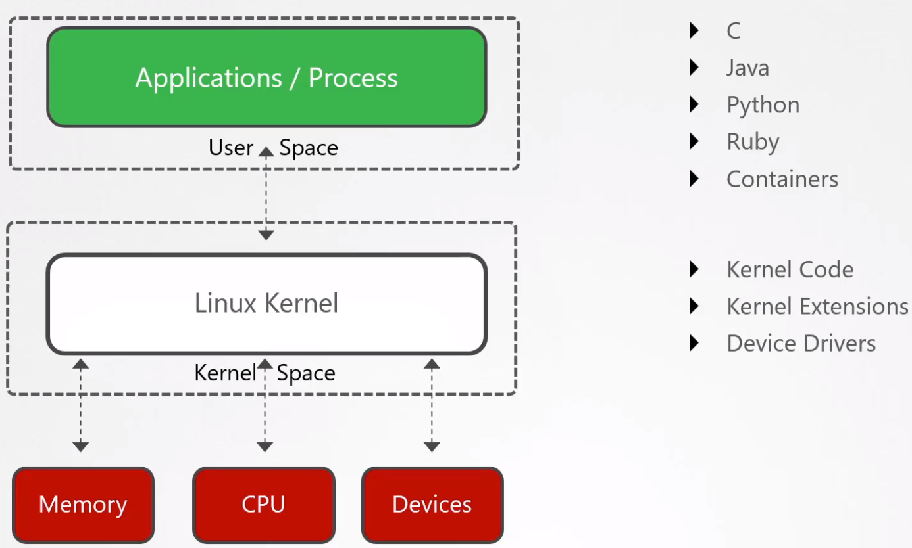

A **system call (syscall)** is a function that allows a process from user space to communicate with the Linux kernel. There are over 400 syscalls, for example `execve` is used to execute a binary.

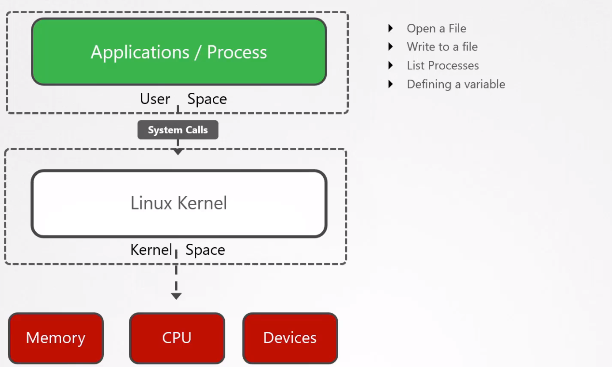

You can trace the syscalls being made by a process using `strace`.

```bash
# Trace the syscalls of a command about to be executed
strace $COMMAND
```

The output below means:
* Call `execve` to execut the program with the following parameters:
  * Execution path.
  * Command & arguments
  * The amount of environment variables the command inherited. This number will match `env | wc -l`


```bash
# Get PID of running command
pidof $RUNNING_CMD

# Trace the syscalls of a command already running
strace -p $RUNNING_CMD
```


Use `strace -c` to view a summary of the entire syscall output.


### AquaSec Tracee

Is an open source tool that uses EBPF and can be used to trace syscalls from a container at runtime. It is easy to run this as a Docker container but it requires a couple of Docker Volume mounts and to run in privileged mode.


Can be used to trace syscalls from a single command.


Can be used to trace syscalls from all new processes in a running container.


Can be used to trace syscalls from all processes in a new container.


### Restricting Syscalls With Seccomp

There are over 400 syscalls in Linux and it is doubtful that an application needs acecss to all of them. By default the Linux kernel will allow any syscalls to be made by any programs running in user space. You can restrict what syscalls an app has access to with a tool like Seccomp.

**Seccomp** stands for secure computing mode and has been a feature of the Linux kernel since version 2.6.12 in 2005. It can be used to sandbox the privileges of a process, restricting the calls it is able to make from userspace into the kernel.


```bash
# Check to see if seccomp is running
grep -i seccomp /boot/config-$(uname -r)
```


```bash
# Check the seccomp filtering level of a running processing
ps aux | grep $PROCESS
grep -i seccomp /proc/$PID/status
```

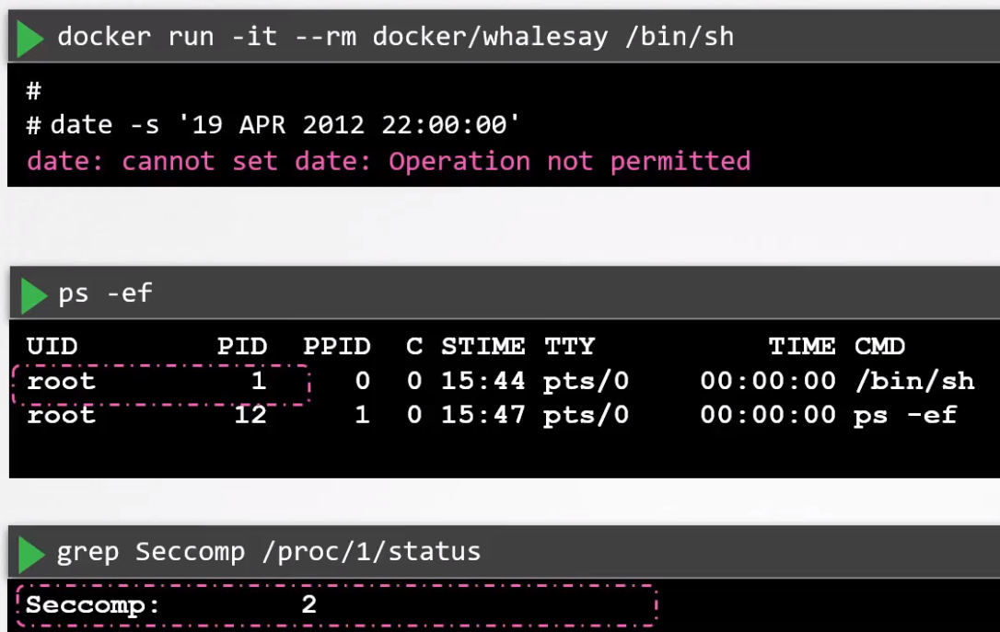


Seccomp has 3 modes:

0. Disabled.
1. Strict mode, only allows `[read, write, exit, rt_sigreturn]`
2. Filtered, used to create allow list and deny lists.


Docker uses this Seccomp mode 2 and applies syscall filters via a JSON file. The default Docker Seccomp deny list JSON file blocks about 60 syscalls on all containers when the CRE host has Seccomp enabled.


The Docker Seccomp JSON file has 3 elements:
1. Architectures array filled with all the CPU architectures it applies to.
2. Syacalls array filled with all the syscalls it is blocking or allowing.
3. Default action determins what to do with syscalls not defined inside the syscalls array.


**Note:** `SCMP_ACT_ERRNO` will reject all other syscalls and `SCMP_ACT_ALLOW` will allow all other syscalls.

You can create additional Seccomp filters to augment the default Docker deny list.

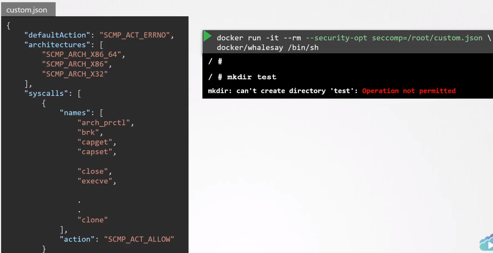

### Seccomp Within k8s

## Kernel Hardening With AppArmor

# 4) Minimising Microservices Vulnerabilities

# 5) Supply Chain Security

# 6) Monitoring, Logging, & Runtime Security

